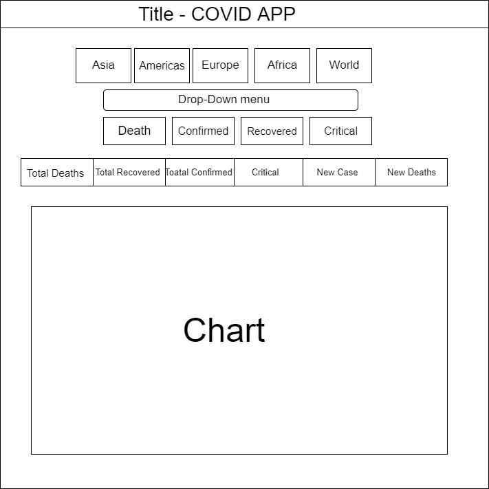

# Covid API Webapp

First ever weekend assigment that uses API, and in this project we used

- **Continent and Country API**
- **COVID API**

## What does each function do?

1. We have **fetchCountryByRegion** function, that first thing, it fetches the data from continent & country API, stores them into two arrays, one saves by name, and the other saves by country code. for example Israel is saved as IL in the second array

2. we have **drawingChart** function, this function takes 3 argument that are collected from the first function, and it draws a chat according to the saved data in the arrays
   

3. Last function in this project is **fetchFromCountry**, this function takes country code as an argument, and once you select something from the dropdown menu that is displayed in the screen. the info data-holders containers will be changed according to that country
   )

Site is also responsive to other platforms.

## Project link

[COVID-WebApp](https://rougenij-covidapp.netlify.com/)
